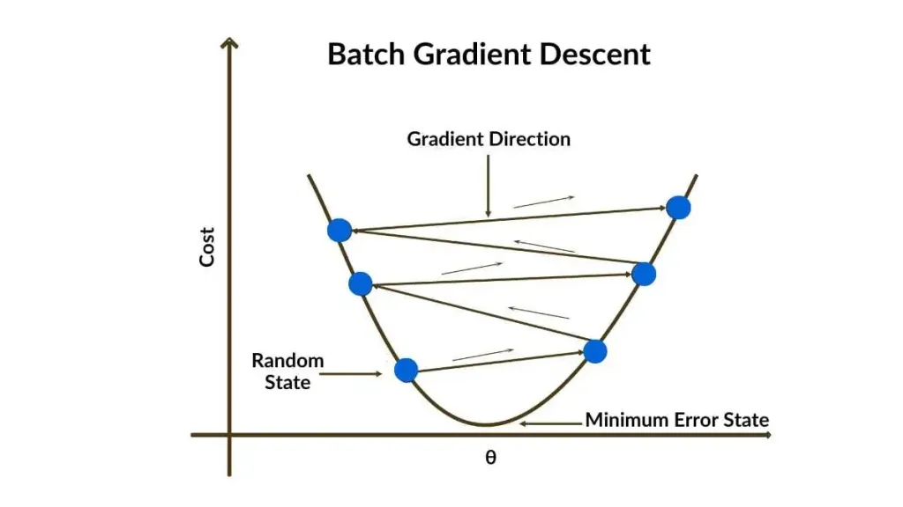
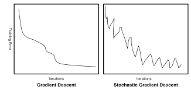

# Optimizers

## What is an optimizer in deep learning?
An optimizer is an algorithm that updates model parameters (weights and biases) to minimize the loss function during training.

## Core role of an optimizer
1. The model makes predictions.
2. A loss value is computed.
3. Gradients are calculated using backpropagation.
4. The optimizer uses these gradients to update the weights.

## General weight update rule
The general first-order update rule for a parameter $w$ is:

$$
w_{\text{new}} = w_{\text{old}} - \alpha\cdot\text{gradient}
$$

Where:
- $w$: model parameter (weight or bias).
- $\alpha$: learning rate (step size).
- gradient: the derivative (direction of greatest increase of the loss).

## First-order optimizers (gradient-based)
These optimizers use first derivatives (gradients) of the loss function. Common families:

- Gradient Descent variants: Batch GD, Stochastic GD (SGD), Mini-batch GD.
- Momentum-based optimizers (Momentum, Nesterov).
- Adaptive learning-rate optimizers (Adagrad, RMSProp, Adam).

## Batch Gradient Descent

Gradient Descent updates parameters in the direction of the negative gradient of the loss to minimize it.

### Example: Mean Squared Error (MSE)
For regression, a common loss is the MSE:

$$
\\text{Loss} = \frac{1}{n}\sum_{i=1}^n (y_i - \hat y_i)^2
$$

Gradient descent asks: "If I slightly change my parameters, will the loss go up or down?" The derivative answers this.

The derivative of a squared error term with respect to the prediction $\hat y$ is:

$$
\frac{d}{d\hat y}\,(y - \hat y)^2 = -2 (y - \hat y).
$$

- If prediction is too small ($\hat y < y$) → derivative is negative → increase prediction.
- If prediction is too large ($\hat y > y$) → derivative is positive → decrease prediction.
- If prediction is perfect ($\hat y = y$) → derivative = 0 → stop updating.

### Worked mathematical example (derivative computation)

| Distance (km) | Observed Time (min) |
| ------------- | -------------------: |
| 5             | 15                   |
| 10            | 30                   |
| 15            | 45                   |

Assume a simple model $\hat y = m x$ and let $m=1$ initially. Predictions are 5, 10, 15 minutes, clearly far from observed times 15, 30, 45.

Define the loss as the sum of squared errors:

$$
L(m) = \sum_{i=1}^3 (y_i - m x_i)^2
$$

Plugging values:

$$
L(m) = (15 - 5m)^2 + (30 - 10m)^2 + (45 - 15m)^2.
$$

Differentiate with respect to $m$:

$$
\frac{dL}{dm} = 2(15-5m)(-5) + 2(30-10m)(-10) + 2(45-15m)(-15).
$$

Substitute $m=1$:

$$
\begin{aligned}
\frac{dL}{dm}\bigg|_{m=1} &= 2(15-5)(-5) + 2(30-10)(-10) + 2(45-15)(-15) \\
&= 2(10)(-5) + 2(20)(-10) + 2(30)(-15) \\
&= -100 - 400 - 900 = -1400.
\end{aligned}
$$

Using gradient descent with learning rate $\alpha = 0.01$:

$$
m_{\text{new}} = m - \alpha \frac{dL}{dm} = 1 - 0.01(-1400) = 1 + 14 = 15.
$$

The update continues until the derivative (gradient) approaches zero.

## Gradient descent procedure (summary)
1. Compute the gradient of the loss with respect to each parameter (the gradient).
2. Choose initial parameter values.
3. Evaluate the gradient at those parameter values.
4. Compute step sizes: step = learning rate × gradient.
5. Update parameters: new = old - step.

## Stochastic Gradient Descent (SGD)

In Gradient Descent (GD) we compute the loss (and gradient) over the full dataset. In Stochastic Gradient Descent (SGD) we use one example (or a small mini-batch) to compute an update. SGD's gradient is an unbiased estimator of the true gradient:

$$
\mathbb{E}[\nabla L_j(w)] = \nabla L(w)
$$

So individual updates can be noisy (one sample may give a small or even opposite-signed gradient), but on average SGD moves in the correct direction.

### One-epoch view (concise)
Let the dataset have $N$ examples. Starting from weights $w_0$, one epoch of (pure) SGD looks like:

1. Pick example $x_1$, compute $g_1 = \nabla L(x_1, w_0)$ and update

$$
w_1 = w_0 - \alpha g_1
$$

2. Pick example $x_2$, compute $g_2 = \nabla L(x_2, w_1)$ and update

$$
w_2 = w_1 - \alpha g_2
$$

... repeat until example $x_N$ gives $w_N$, which completes one epoch. Then shuffle and repeat for the next epoch.

### Why noise appears in SGD
- Batch GD uses the full dataset to compute the exact gradient.
- SGD uses a random subset (often a single example), producing an estimate; the estimation error appears as noise.
### SGD procedure (summary)
1. Take one (or a mini-) batch.
2. Compute the gradient using current weights.
3. Update weights immediately: $w\leftarrow w - \alpha \nabla L_{\text{batch}}(w)$.
4. Repeat until all data are processed (one epoch), then shuffle for the next epoch.

### Clean comparison: GD vs SGD

| Aspect              | GD   | SGD |
| ------------------- | ---- | --- |
| Gradients per epoch | N    | N   |
| Updates per epoch   | 1    | N   |
| Memory              | High | Low |
| Early learning      | No   | Yes |
| Scales to big data  | No   | Yes |
